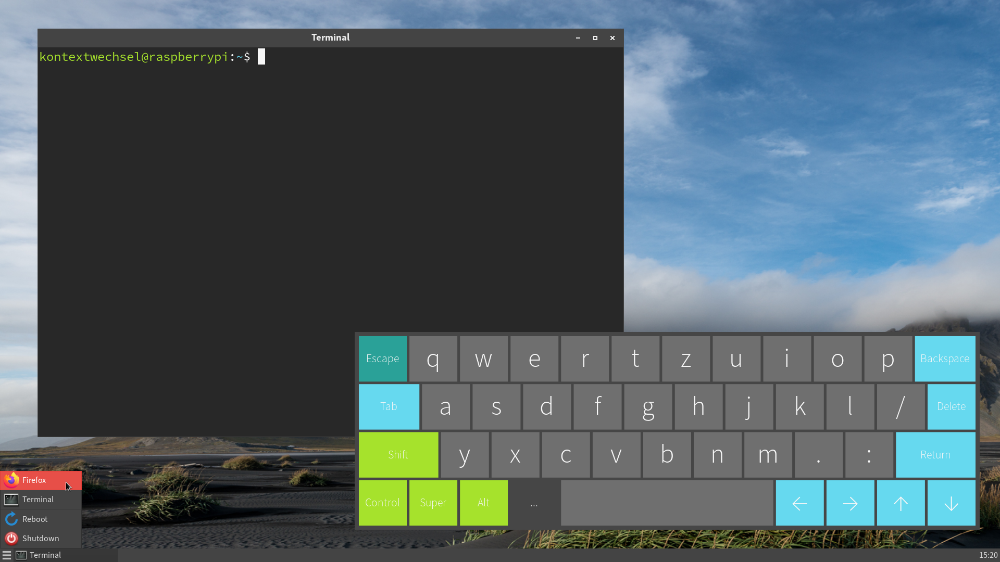
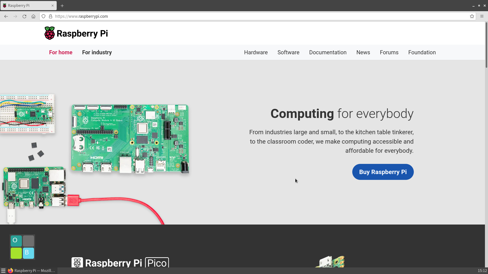

# Raspberry Pi

Minimal desktop environment for Raspberry Pi with [Openbox](http://openbox.org/) and [fbpanel](http://aanatoly.github.io/fbpanel/).

## Installation

1. Install [Raspberry Pi OS Lite](https://www.raspberrypi.com/software/operating-systems/).
2. Execute **raspberry-pi-installation** and reboot.

## Screenshots

